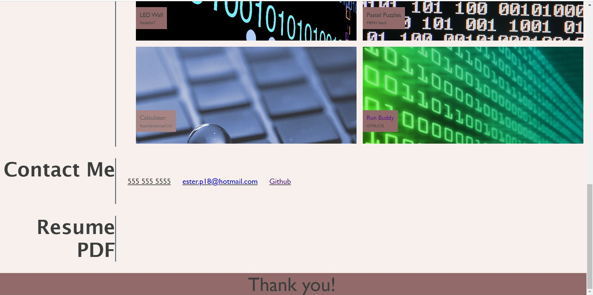

# Portfolio 
A presentation of my work as a Web Developer

# 02 Advanced CSS Challenge

Link to page: https://efp18.github.io/Portfolio/

# Description
This project presents my Portfolio, a place where I can present 
my knowledge and abilities. It is a responsive website that works well both for larger screens in Computers, as well as in mobile phone screens. To achieve this, I used media-queries and flexbox. 

Flexbox was my biggest challenge, and I hope I can work with it again
to practice what I implemented in the creation of this project, and more. 

A challenge I faced was making the screen responsive between 768 px and 1080 px, in which some features weren't behaving as wanted and or expected. 

My code and my page have the following layout:

- Header and navigation bar
  - Header has a profile picture.
  - Navigation bar jumps to the right section when clicking on elements.

- Main section of the code includes:
  - A section with information about me. 
  - A section with links of my previously done work and applications, which currently only includes my code-refactor challenge. 
  - A contact me section with a mailto link behind my email address 
  for easy and fast communication. 

